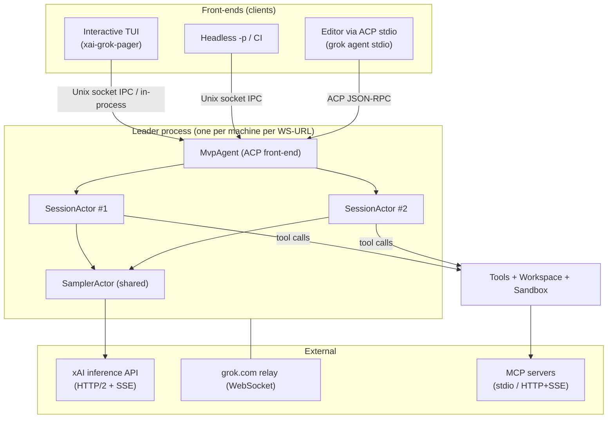
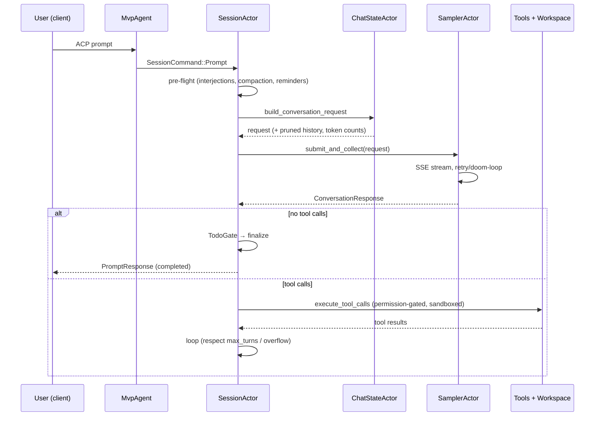

# Grok Build (`gumgrok`) — Architecture, Features & Capabilities

> Developer-facing reference for the Rust source in this repository. It describes
> how the system is structured (Architecture), what it does (Features), and what
> it can do (Capabilities). For end-user how-to docs see
> [`crates/codegen/xai-grok-pager/docs/user-guide/`](../crates/codegen/xai-grok-pager/docs/user-guide/).

---

## Table of contents

1. [Overview](#1-overview)
2. [System architecture](#2-system-architecture)
   - [2.1 High-level topology](#21-high-level-topology)
   - [2.2 Crate map](#22-crate-map)
   - [2.3 Run modes & entry points](#23-run-modes--entry-points)
   - [2.4 Leader/client process model](#24-leaderclient-process-model)
   - [2.5 Composition root & IoC seams](#25-composition-root--ioc-seams)
   - [2.6 Async runtime & lifecycle](#26-async-runtime--lifecycle)
   - [2.7 Agent runtime — the actor model & turn loop](#27-agent-runtime--the-actor-model--turn-loop)
   - [2.8 Model & inference layer](#28-model--inference-layer)
   - [2.9 Context management](#29-context-management)
   - [2.10 Tools subsystem](#210-tools-subsystem)
   - [2.11 Workspace subsystem](#211-workspace-subsystem)
   - [2.12 Security model — sandbox & permissions](#212-security-model--sandbox--permissions)
   - [2.13 MCP & the Computer Hub](#213-mcp--the-computer-hub)
   - [2.14 TUI rendering stack](#214-tui-rendering-stack)
3. [Features & capabilities](#3-features--capabilities)
4. [Life of a turn (end to end)](#4-life-of-a-turn-end-to-end)
5. [Build & distribution](#5-build--distribution)
6. [Appendix — crate reference](#6-appendix--crate-reference)

---

## 1. Overview

**Grok Build** (binary artifact `gumgrok`; officially shipped as `grok`) is
SpaceXAI's terminal-based AI coding agent. It runs as a full-screen TUI that
understands a codebase, edits files, executes shell commands, searches the web,
and manages long-running tasks — interactively, headlessly for scripting/CI, or
embedded in editors via the Agent Client Protocol (ACP).

| Fact | Value |
|------|-------|
| Language | Rust (edition 2024, toolchain pinned `1.92.0` in `rust-toolchain.toml`) |
| Size | ~1.32M lines across **75 crates** (`crates/codegen/`, `crates/common/`, `crates/build/`, `prod/mc/`) |
| Binary | one composition-root binary, `xai-grok-pager-bin` → artifact `gumgrok` |
| Concurrency | Tokio; single-threaded **actor model** (`LocalSet`, `Rc`) for the agent core |
| Default model | `grok-build` (500k context window, Responses API backend) |
| Transports | HTTP/2 + SSE for inference; Unix-socket IPC + WebSocket relay for multi-client |
| Platforms | macOS & Linux (build hosts); Windows best-effort |

The design separates four concerns that recur throughout the codebase:

- **Front-end / transport** — the TUI, headless runner, ACP stdio server, and the
  multi-client *leader*.
- **Agent core** — an actor that drives the agentic turn loop (prompt → model →
  tools → repeat).
- **Tools & workspace** — the capabilities the agent exercises (files, shell,
  search, web, VCS), gated by a permission engine and OS sandbox.
- **Extensibility** — skills, plugins, hooks, MCP servers, and custom models.

---

## 2. System architecture

### 2.1 High-level topology



Two independent planes:

- **Inference plane** — the `SamplerActor` speaks HTTP/2 + Server-Sent Events to the
  model API. This is the *only* path model tokens travel.
- **Relay/IPC plane** — the *leader* multiplexes many front-end clients (TUI,
  desktop, headless) over a Unix-domain socket, and optionally holds a grok.com
  relay WebSocket. This plane carries ACP messages, not model inference.

### 2.2 Crate map

Crates are grouped by role (75 total; representative members shown).

| Group | Crates | Responsibility |
|-------|--------|----------------|
| **Composition root** | `xai-grok-pager-bin` | The one binary; wires allocator, crash handler, sandbox, IoC seams, dispatches run modes |
| **Front-end / TUI** | `xai-grok-pager`, `xai-grok-pager-render`, `xai-grok-pager-minimal`, `xai-ratatui-inline`, `xai-ratatui-textarea` | Scrollback, prompt editor, modals, rendering, input, minimal render mode |
| **Agent runtime** | `xai-grok-shell`, `xai-grok-agent`, `xai-agent-lifecycle`, `xai-acp-lib` | Turn loop, session actors, leader/stdio/headless entry points, ACP plumbing, lifecycle hooks |
| **Model / inference** | `xai-grok-models`, `xai-grok-sampler`, `xai-grok-sampling-types`, `xai-grok-http`, `xai-grok-auth` | Model catalog, SSE streaming client, retry/doom-loop, HTTP clients, auth |
| **Context** | `xai-grok-compaction`, `xai-token-estimation`, `xai-chat-state`, `xai-prompt-queue`, `xai-grok-memory` | Compaction, token accounting, conversation state, queue, long-term memory |
| **Tools** | `xai-grok-tools`, `xai-grok-tools-api`, `xai-tool-runtime`, `xai-tool-protocol`, `xai-tool-types` | Tool catalog, the `Tool` trait, dispatch, wire protocol |
| **Workspace** | `xai-grok-workspace` (+ `-client`, `-types`), `xai-fast-worktree`, `xai-hunk-tracker`, `xai-gix-status`, `xai-codebase-graph`, `xai-fsnotify`, `xai-file-utils`, `ptyctl` | Host FS, VCS, worktrees, checkpoints, code graph, PTY control |
| **Security** | `xai-grok-sandbox`, `xai-grok-secrets` | OS sandbox (Landlock/Seatbelt), secret redaction; permission engine lives in the workspace crate |
| **MCP / Hub** | `xai-grok-mcp`, `xai-computer-hub-core`, `xai-computer-hub-sdk`, `xai-computer-hub-mcp-adapter` | MCP client, tool-routing fabric |
| **Extensibility** | `xai-grok-hooks`, `xai-grok-plugin-marketplace`, `xai-hooks-plugins-types`, `xai-grok-config`, `xai-grok-config-types`, `xai-grok-subagent-resolution` | Hooks, plugins, config, subagent resolution |
| **UX / rendering aids** | `xai-grok-markdown`, `xai-grok-markdown-core`, `xai-grok-mermaid`, `xai-grok-voice` | Streaming markdown, Mermaid→PNG, voice dictation |
| **Ops** | `xai-grok-update`, `xai-grok-telemetry`, `xai-mixpanel`, `xai-grok-announcements`, `xai-crash-handler`, `xai-tracing` | Auto-update, telemetry/OTel, announcements, crash handling |
| **Resilience / util** | `xai-circuit-breaker`, `xai-interjection-core`, `xai-secrets`, `xai-file-utils` | Circuit breaker, mid-turn interjection, blob upload |

> The root `Cargo.toml` (members, dependency versions, lints, profiles) is
> **generated** and treated as read-only; edit per-crate manifests.

### 2.3 Run modes & entry points

`main()` (`xai-grok-pager-bin/src/main.rs`) is a thin composition root — it is *not*
`#[tokio::main]`; it builds an explicit multi-thread runtime and drives it through
`run_and_shutdown(...)` with a bounded 2s shutdown grace so exit can never hang.
`async_main()` parses `PagerArgs` (`xai-grok-pager/src/app/cli.rs`) and dispatches:

| Mode | Trigger | Entry point | Use |
|------|---------|-------------|-----|
| **Interactive TUI** | no subcommand/prompt | `xai_grok_pager::app::run` | Default full-screen experience |
| **Headless** | `-p` / `--prompt-json` / `--prompt-file` | `xai_grok_pager::headless::run_single_turn` | Scripting, CI/CD, piping |
| **ACP stdio** | `grok agent stdio` | `run_stdio_agent` (`xai-grok-shell/src/agent/app.rs`) | Editor/IDE embedding via ACP JSON-RPC |
| **Headless agent** | `grok agent headless` | `run_headless` | Automation over the grok.com relay WebSocket |
| **Serve** | `grok agent serve --bind …` | `run_agent_server` | Agent as a WebSocket server |
| **Leader** | `grok agent leader` / auto | `run_leader` | Shared multi-client backend (below) |
| **CLI subcommands** | `version`, `mcp`, `plugin`, `models`, `worktree`, `sessions`, `memory`, `update`, `login/logout`, `inspect`, `dashboard`, `setup`, `wrap`, `completions`, … | per-command handlers | One-shot management |

The top-level clap command is `grok` (`#[command(name = "grok")]`); the executable
resolves its own program name from `argv[0]`, accepting `grok`, `agent`, or
`gumgrok` (else it falls back to `grok`). Global flags include `--model`,
`--reasoning-effort`, `-w/--worktree`, `--resume`/`--continue`/`--fork-session`,
`--yolo`, `--minimal`/`--fullscreen`, `--leader`/`--no-leader`, and `--output-format`.

### 2.4 Leader/client process model

`xai-grok-shell/src/leader/` implements a **single leader per machine per WS-URL**:
one process owns the agent (`MvpAgent`) and its persisted state (`~/.grok/`), while
multiple clients (TUI, IDE stdio, headless) attach over a Unix-domain socket and
share that backend.

- **Discovery / spawn** — `connect_or_spawn` (`leader/mod.rs`): if a socket is
  listening and the lock PID is alive, adopt it; otherwise acquire an OS `flock`,
  spawn a leader subprocess, wait for the socket, then connect. Socket/lock paths
  are derived per WS-URL (`socket_path_for_ws_url`) so dev/prod/branch endpoints get
  isolated leaders; `GROK_LEADER_SOCKET` overrides.
- **Version skew** — a strictly-newer client *evicts* an older leader and respawns
  (semver-gated, dev builds excluded), so the fleet converges to the newest binary.
  The handshake (`leader/protocol.rs`, `LEADER_PROTOCOL_VERSION = 1`) uses
  `#[serde(default)]` on all newer fields so mixed-version clients still complete
  registration.
- **Wire format** — 4-byte big-endian length prefix + JSON body (64 MiB cap),
  `read_frame`/`write_frame` in `xai-acp-lib`. A **control channel** carries
  `GetLeaderInfo`, CPU-profile start/stop, workspace start/pause/resume, and
  `RelaunchForUpdate`.
- **Reconnection** — bounded (5 attempts) for headless/`-p`; unbounded
  (cancellation-driven) for the TUI, with 1s→30s backoff.
- **Client capabilities** (`yolo_mode`, `auto_mode`, `default_model`, `terminal`,
  `fs_read`/`fs_write`, …) are injected into `session/new`/`session/load` so each
  client gets correctly-scoped routing.

The interactive TUI is itself just another leader client: `connect_via_leader`
bridges raw-JSON IPC into the same typed `(AcpAgentTx, AcpClientRx)` pair the
in-process path produces, so the rest of the TUI is transport-agnostic.

### 2.5 Composition root & IoC seams

`xai-grok-pager-bin` exists separately from the `xai-grok-pager` library to own
concerns the library must not: allocator, crash handler, sandbox init, and
dependency-cycle-forming render modes. At startup `main()` installs several
**inversion-of-control seams** (function pointers registered once):

- **Minimal render mode** — `xai-grok-pager-minimal` reads deep into the pager's
  view model, so the pager can't depend on it (cycle). Instead the pager exposes a
  `MinimalHooks { draw: fn(...) }` seam and the binary calls
  `xai_grok_pager_minimal::install()` on line 1 of `main()`. Minimal branches are
  inert if not installed.
- **Allocator** — `#[global_allocator]` jemalloc, gated on `cfg(all(feature="jemalloc", unix))`, with arena-purge/stats/heap-profile hooks installed via `memory_release`/`memory_trace`.
- **Crash handler** — `xai-crash-handler` installs terminal-restore always, plus
  crash capture + previous-crash reporting when enabled.
- **Sandbox** — `xai_grok_shell::config::apply_sandbox(...)` applied before the main
  dispatch (irreversible, see §2.12).
- **Mermaid worker** — `mermaid_worker::maybe_run_render_subprocess()` re-execs the
  binary as an out-of-process Mermaid renderer (untrusted-input isolation).

### 2.6 Async runtime & lifecycle

- Explicit multi-thread Tokio runtime; `runtime.shutdown_timeout(2s)` guarantees a
  bounded exit even with an uncancellable blocking task in flight.
- The **agent core runs on a `LocalSet`** (single-threaded actor model): `MvpAgent`
  is `Rc`-based and `!Send`; the ACP gateway defaults to `spawn_local`.
- `tokio_util::sync::CancellationToken` is the pervasive shutdown signal; the leader
  publishes a `ShutdownReason` (`AutoUpdate`/`Manual`) over a `watch` channel so
  clients reconnect onto the new binary after an update.
- Graceful shutdown flushes telemetry, closes PTY sessions, drains the upload queue,
  and flushes sandbox state on every exit path. SIGINT/SIGTERM/SIGHUP map to exit
  codes 130/143/129.
- **`xai-agent-lifecycle`** provides host-agnostic, typed hook points (turn
  start/done/error/abort, session lifecycle, idle, command injection) in `Send` and
  `local` flavors; hosts populate them at startup while loop control stays inside the
  agent core.

### 2.7 Agent runtime — the actor model & turn loop

The runtime is an **actor tree**: `MvpAgent` (ACP front-end) owns a map of
`SessionActor`s; each session owns a `ChatStateActor` and shares a `SamplerActor`.
Communication is `mpsc` command channels + `oneshot` replies. Three nested loops
(`xai-grok-shell/src/session/acp_session_impl/`):

1. **Session command loop** (`run_loop.rs::run_session`) — a `select!` over commands
   (`Prompt`, `Cancel`, `Interject`, `SetSessionModel`, `CompactSession`, MCP
   toggles), turn completions, chat-state events, and idle/memory timers.
2. **Turn promotion** (`notification_drain.rs::maybe_start_running_task`) — enforces
   single-turn concurrency and pops the next queued input.
3. **Core agentic loop** (`turn.rs::process_conversation_turn`) — one iteration per
   model round-trip:
   - **Pre-flight injections**: pending interjections, skill reminders, monitor
     events, memory reminders, MCP reminders; optional two-pass prefire; inline
     auto-compaction if near the context threshold.
   - **Assembly**: tool specs (+ optional `StructuredOutput`/backend-search tools) +
     `build_conversation_request` (from `xai-chat-state`).
   - **Model request** via `run_turn_via_sampler` → `SamplerHandle::submit_and_collect`,
     which may return `Response`, `CompactAndResubmit` (context overflow), or
     `RefreshAuthAndResubmit` (401 recovery with backoff).
   - **Ingest**: record token usage; push assistant + tool-result items.
   - **Termination**: if no tool calls, run the **TodoGate** (may inject a reminder
     and continue), finalize, and complete.
   - **Tool dispatch**: otherwise `execute_tool_calls` (permission-gated), enforce
     `max_turns`, check overflow (compact), and loop.

### 2.8 Model & inference layer

- **Catalog** — `xai-grok-models` loads an embedded `default_models.json`. Default is
  `grok-build` (context 500k, `temperature 0.7`, `top_p 0.95`, Responses API).
  Separate slots exist for `web_search`, `image_description`, and `session_summary`.
  Resolution precedence: **CLI flag > env > `config.toml` > remote settings > JSON
  defaults**.
- **Transport** — `xai-grok-sampler` speaks three backend shapes selected by
  `ApiBackend`: `ChatCompletions` (`/chat/completions`), `Responses` (`/responses`,
  used by `grok-build`), and `Messages` (Anthropic `/messages`). Streaming decode is
  SSE (`eventsource_stream`). WebSockets appear only on the relay/IPC plane, never
  for inference.
- **Streaming stack (3 layers)** — raw chunk stream → per-backend transform into a
  unified `SamplingEvent` → `SamplerActor`/`SamplerHandle` running requests
  concurrently on a `JoinSet` with a per-request `oneshot` and `CancelOnDrop` guard.
- **HTTP clients** — `xai-grok-http` provides pooled HTTP/2 clients, an HTTP/1.1
  upload client, and a pool-escape path on the final retry; TLS roots are pre-warmed.
- **Reasoning** — `ReasoningEffort` (`none`/`minimal`/`low`/`medium`/`high`/`xhigh`;
  `max` aliases `xhigh`; default `medium`) is mapped per backend and propagated
  through ACP `_meta`.

### 2.9 Context management

- **Compaction** — `xai-grok-compaction` is a transport-agnostic engine with three
  styles: `code_compaction` (grok-build's whole-session full-replace summarization),
  `intra_compaction` (tail-keep), and `inter_compaction` (chunked). It is decoupled
  via `CompactionItem`/`ItemTokenCounter`/`CompactionSampler` traits. The turn loop
  triggers it on auto-threshold and on pre-flight overflow.
- **Token estimation** — `xai-token-estimation` uses a `bytes/4` heuristic (images
  ≈765 tokens) for fast auto-compact gating; `xai-chat-state` does richer per-item
  estimation.
- **Chat state** — `xai-chat-state` is a dedicated actor owning the conversation
  vector, sampling config, and token totals. Per turn it evicts inline images near a
  ~50 MB body cap, prunes tool results above ~50% context utilization, injects memory
  reminders, and repairs dangling tool calls.
- **Prompt queue** — `xai-prompt-queue` lets users stack, reorder, edit, and
  interject prompts mid-session (broadcast via `x.ai/queue/changed`).
- **Long-term memory** *(experimental; `--experimental-memory` / `GROK_MEMORY=1`)* —
  `xai-grok-memory` keeps a Markdown store under `~/.grok/memory/` (global,
  per-workspace, per-session) with a `sqlite-vec` embedding index, MMR re-ranking,
  query expansion, and a background "dream" consolidation pass. Exposed via `/memory`,
  `/flush`, `/dream`, `/remember`.

### 2.10 Tools subsystem

- **The `Tool` trait** (`xai-tool-runtime`) has typed `Args` (Deserialize +
  JsonSchema) and `Output`, a streaming `execute()` producing a
  `[Progress*, Terminal]` stream, and an object-safe `ToolDyn`/`ToolDispatch` router.
- **Wire protocol** (`xai-tool-protocol`) is JSON-RPC 2.0 — the "Computer Hub"
  protocol: session/server bind, tool-call frames, progress frames, tool-list/search,
  and observability donation frames, with typed ID newtypes and a numeric↔string
  error mapping.
- **Registry & tool packs** (`xai-grok-tools`) — a process-global tool-pack system
  lets out-of-tree crates inject tools without an inbound dependency; a
  `ToolFamily`/`ToolVariant` mechanism routes one stable `ToolId` to multiple
  implementations (e.g. concise/hashline variants).
- **Namespaces** — `grok_build` (native), `grok_build_concise`, `grok_build_hashline`
  (anchor-based edits with stale-anchor recovery), `codex` (ported from openai/codex,
  Apache-2.0), `opencode` (ported from sst/opencode, MIT), and `mcp`.

The full tool catalog is in [§3.2](#32-tool-catalog).

### 2.11 Workspace subsystem

`xai-grok-workspace` is the host substrate (FS, VCS, permissions, execution,
checkpoints). It can run in-process or as a daemon.

- **Filesystem** — local/client/ACP/ext/mock backends, a file tree with fuzzy walk,
  and live semantic FS events via `xai-fsnotify` (single causal event stream, debounced).
- **VCS** — git via `gix` (`xai-gix-status`, thread-budget-capped) *and* jujutsu (`jj`)
  status. `xai-hunk-tracker` attributes diff hunks to **agent vs external** edits.
- **Worktrees** — `xai-fast-worktree` creates worktrees fast via CoW: `git worktree
  add --no-checkout` + parallel copy-on-write, **BTRFS snapshots** (O(1)) or
  **overlayfs** on Linux, with a privileged-helper delegate when running without
  `CAP_SYS_ADMIN`.
- **Checkpoints / rewind** — per-`prompt_index` checkpoints bundle filesystem state,
  hunk deltas, and git HEAD/index; restore reverts all enabled domains together.
- **Code intelligence** — `xai-codebase-graph` is a tree-sitter code graph
  (go-to-def/references, incremental indexing, rayon parse, mmap zero-copy cache);
  `xai-grok-tools`' `LspTool` adds live language-server navigation.
- **PTY** — `ptyctl` is a headless PTY controller (spawn, keystrokes, screen scrape as
  text/styled/HTML) built on `alacritty_terminal`.

### 2.12 Security model — sandbox & permissions

Two complementary layers:

**OS sandbox** (`xai-grok-sandbox`) — applied once at startup, **irreversible**,
covering in-process `tokio::fs` *and* child processes. Backed by the `nono` crate:
**Landlock** on Linux, **Seatbelt** on macOS.
- Built-in profiles: `workspace` (default — read all, write essentials), `devbox`
  (all writable except `/data`), `read-only`, `strict` (explicit read allowlist,
  network restricted), `off`. Custom profiles via `~/.grok/sandbox.toml` /
  `.grok/sandbox.toml` extend a built-in; **project config is additive-only** so a
  malicious workspace cannot hollow out a trusted profile.
- **Deny enforcement** is kernel-level on both platforms (macOS Seatbelt deny rules,
  order-sensitive — hence the exact `nono` pin; Linux `bwrap` re-exec with `--ro-bind`
  / mode-000 binds). Network stays open at process level (the agent needs the API) but
  **child-process network is blocked per-process via seccomp-BPF** when the profile
  restricts network.
- The `enforce` feature is a marker only; the crate compiles and degrades gracefully
  where the OS backend is unavailable (fails *open*, logging violations).

**Permission engine** (`xai-grok-workspace/src/permission/`) — the gate for dangerous
ops, distinct from the sandbox.
- `AccessKind`: `Read`, `Grep`, `Edit`, `Bash`, `MCPTool`, `WebFetch`, `WebSearch`.
- `Decision`: `Allow`, `Ask`, `Reject`, `PolicyDeny` (returned to the LLM to adapt,
  vs a user `Reject`), `Cancelled`, `FollowupMessage`.
- A `CompiledPolicy` matches pre-compiled glob/domain rules; **bash commands are split
  per-segment** and each subcommand is evaluated and combined, so `a && b` can't
  smuggle a denied command past an allowed one.
- Modes: **YOLO** (auto-approve all) and **auto** (heuristic + LLM classifier), mutually
  exclusive, with a fast-path allowlist and a `decision_reason` taxonomy for telemetry.
- **Trust tiers** (`RequirementSource`) distinguish a user `requirements.toml`
  (untrusted) from root-owned system requirements and admin-pinned managed settings, so
  a restricted user cannot override an admin policy. Claude Code `permissions` settings
  are translated for compatibility.

**Secret redaction** (`xai-grok-secrets`) — a `RegexSet` sanitizer scrubs outbound
telemetry/crash data of 10 secret shapes (vendor/xAI keys, AWS, GitHub/GitLab/Slack/
Google tokens, PEM blocks, bearer tokens, bare JWTs, sensitive `key=value`, URL
credentials/params) and PII paths (`$HOME`→`~`, username→`<user>`).

### 2.13 MCP & the Computer Hub

The **xAI Computer Hub** is the tool-routing fabric (not browser/computer-use).

- `xai-grok-mcp` is the MCP client, deliberately quarantining `rmcp`/`reqwest` versions
  from the workspace's. It handles stdio (`TokioChildProcess`) and HTTP+SSE
  (`StreamableHttpClientTransport`) transports, browser OAuth, an on-disk credential
  store, cross-provider tool-name validation, and server-qualified `server__tool` names.
- `xai-computer-hub-core` provides the `Transport` (authorises + dispatches with a
  `Principal`), `ToolRegistry`, and a `CompoundResolver` implementing **local-shadows-
  remote** resolution.
- `xai-computer-hub-sdk` is the tool-server/harness SDK with a connection pool that
  multiplexes frames over one WebSocket per `(url, principal)`.
- The model reaches MCP tools through two meta-tools: **`search_tool`** (BM25 discovery
  over MCP tool descriptions) and **`use_tool`** (dispatch to a discovered `server__tool`).

### 2.14 TUI rendering stack

Three layers built on **ratatui + crossterm**:

- `xai-grok-pager` — the application: state, dispatch, views, the interactive
  `ScrollbackPane`.
- `xai-grok-pager-render` — shared presentation primitives (draw pipeline, wrapping,
  scrollbar, OSC-8 hyperlinks, image/video/preview overlays, theme, terminal capability
  probes, syntax highlighting, clipboard).
- Custom widgets: `xai-ratatui-inline` (native-scrollback terminal; `insert_before`
  prints finalized blocks into the terminal's own scrollback) and `xai-ratatui-textarea`
  (multi-line prompt editor with readline + vim modes).

**Render modes**: *fullscreen* (alt-screen TUI with interactive scrollback) and
*minimal* (`grok --minimal` — finalized blocks printed once into native scrollback,
only a small pinned live region; no theming, native 16-color). The mode is sticky in
`[ui].screen_mode`. The event loop is a thin `tokio::select!` with a dedicated input
reader thread; all routing/rendering is delegated to `AppView`.

---

## 3. Features & capabilities

### 3.1 Interaction modes

- **Interactive TUI** — full-screen agentic coding with scrollback, plan mode,
  modals, and mouse support.
- **Headless** (`grok -p "…"`) — single-turn automation for scripts/CI with selectable
  output format (text/JSON) and JSON-schema-constrained output.
- **ACP / editor embedding** (`grok agent stdio`) — newline-delimited JSON-RPC over
  stdio; drives the agent from an IDE/host.
- **Agent server** (`grok agent serve`) — the agent as a WebSocket service.
- **Multi-client leader** — several front-ends share one backend and session set.

### 3.2 Tool catalog

Native `grok_build` tools (plus concise/hashline variants and ported codex/opencode
namespaces):

| Category | Tools |
|----------|-------|
| **File I/O** | `read_file` (text, images, PDF, PPTX), `search_replace` (old/new string, `replace_all`), `list_dir`; codex `apply_patch`; hashline anchor-based read/edit |
| **Search** | `grep` (ripgrep backend), codex `grep_files`, opencode `glob`/`grep` |
| **Terminal & tasks** | `bash` (persistent shell, foreground + background, 16 KiB/frame streaming), `monitor` (watch/tail), `task` (subagents), `task_output`/`wait_tasks`, `kill_task`/`kill_terminal_command`, scheduler (`scheduler_create/delete/list` — cron/interval/loop) |
| **Planning / interaction** | `enter_plan_mode`/`exit_plan_mode`, `ask_user_question`, `todo` (`TodoWrite`), `update_goal` |
| **Web** | `web_search`, `web_fetch` (SSRF guard, domain allowlist, caching, artifact extraction) |
| **Code intelligence** | `lsp` (go-to-def/refs via language servers) |
| **Media** | `image_gen` (`imagine`), `image_edit`, `image_to_video`, `reference_to_video` |
| **Memory / discovery** | `memory_search`, `memory_get`, `search_tool` (BM25 over MCP tools), `use_tool` (MCP dispatch), skill discovery |
| **Deploy** | `deploy_app` (stub) |

Bundled search binaries (ripgrep always; ugrep/bfs when the release pipeline supplies
them) self-extract to `~/.grok/vendor/`.

### 3.3 Extensibility

| Mechanism | What it adds | Where configured |
|-----------|--------------|------------------|
| **Skills** | Reusable prompt packages (`SKILL.md`, YAML frontmatter + Markdown); `commands/*.md` become slash commands | `./.grok/skills/`, `<repo>/.grok/skills/`, `~/.grok/skills/`, `~/.claude`/`~/.cursor` (compat); `[skills]` |
| **Plugins** | Bundle skills + commands + agents + hooks + MCP + LSP; install from marketplace sources | `.grok/plugins/`, `~/.grok/plugins/`, `[plugins]`, `[[marketplace.sources]]`; `grok plugin …` |
| **Hooks** | Lifecycle scripts / HTTP callbacks for tool-use and session events (`PreToolUse` is the only blocking one) | `~/.grok/hooks/*.json`, `.grok/hooks/`, Claude/Cursor compat; folder-trust gated |
| **MCP servers** | External tool integrations (stdio or HTTP/SSE) | `[mcp_servers.<name>]`; `/mcps` modal; `grok mcp …` |
| **Custom models** | BYO-key, Ollama, OpenAI/Anthropic-compatible endpoints | `[model.<name>]` (`base_url`, `api_backend`, `env_key`, …) |
| **Project rules** | Per-directory `AGENTS.md` instructions with precedence | `AGENTS.md` |
| **Tool packs** | Out-of-tree tool registration | process-global `register_tool_pack()` |

Hook events: `SessionStart`, `SessionEnd`, `Stop`, `StopFailure`, `PreToolUse`,
`PostToolUse`, `PostToolUseFailure`, `PermissionDenied`, `UserPromptSubmit`,
`Notification`, `SubagentStart`, `SubagentStop`, `PreCompact`, `PostCompact`.

### 3.4 UX features

- **Slash commands** (selection): `/new` (`/clear`), `/resume`, `/compact`, `/context`,
  `/fork`, `/rewind`, `/model` (`/m`), `/effort`, `/plan`, `/auto`, `/always-approve`,
  `/minimal`, `/fullscreen`, `/theme` (`/t`), `/vim-mode`, `/hooks`, `/plugins`,
  `/marketplace`, `/skills`, `/mcps`, `/memory`, `/flush`, `/dream`, `/remember`,
  `/imagine`, `/imagine-video`, `/loop`, `/usage`, `/settings`, `/export`, `/copy`,
  `/personas`, `/login`/`/logout`, `/docs`, `/import-claude`. Skills with
  `user-invocable: true` also appear (qualified `/local:`/`/user:`/`/repo:`/`/plugin:`
  on collision).
- **Keyboard** (built-in, not remappable): `Ctrl+P`/`?` palette, `Ctrl+C` cancel,
  `Shift+Tab` cycle mode (Normal→Plan→Always-approve), `Ctrl+O` YOLO, `Ctrl+S` session
  picker, `Ctrl+T` todos, `Ctrl+B` tasks, `Ctrl+G` background a task, `Ctrl+L`
  extensions modal, `F2`/`Ctrl+,` settings; per-terminal rebinding for VS Code/Cursor/
  Windsurf/Zed, Apple Terminal, WezTerm, Windows.
- **Plan mode** — a four-state machine; read-only except `plan.md`; approval gate before
  coding; persisted across restarts.
- **Themes** — five built-ins (GrokNight default, GrokDay, TokyoNight, RosePineMoon,
  OscuraMidnight); `theme = "auto"` follows OS appearance (macOS/Linux/Windows/SSH);
  automatic truecolor/256/16-color quantization; `NO_COLOR` support.
- **Markdown & diagrams** — streaming/incremental Markdown with syntect highlighting and
  LaTeX→Unicode; **Mermaid rendered to PNG with no Node/browser/network** (pure-Rust
  dagre engine, resvg/tiny-skia rasterizer, out-of-process for untrusted input).
- **Voice** — dictation: mic → streaming xAI STT → prompt box (`/voice`); cpal on
  macOS/Windows, `pw-record`/`parec`/`arecord` on Linux.
- **Media display** — inline images/video overlays in supporting terminals.

### 3.5 Context & session capabilities

- **Sessions** — save/load/resume/fork/rewind/compact; persisted under `~/.grok/`.
- **Rewind** — per-prompt checkpoints revert filesystem + hunks + git together.
- **Subagents / personas** — parallel child sessions resolved by
  `xai-grok-subagent-resolution` (precedence: explicit override > role > persona >
  parent), coordinated by a `SubagentCoordinator`; blocking queries poll with a
  timeout.
- **Background tasks & monitoring** — `background: true` bash, `/loop`, the `monitor`
  tool, and `Ctrl+G` to demote a running turn.
- **Long-term memory** *(experimental)* — cross-session knowledge with hybrid vector
  search.

### 3.6 Safety & security capabilities

OS sandbox (Landlock/Seatbelt) with additive-only project profiles; a per-segment bash
permission engine with YOLO/auto modes and admin-pinnable trust tiers; per-process
child-network seccomp blocking; WebFetch SSRF guard + domain allowlist; secret/PII
redaction on all outbound telemetry; folder-trust gating for hooks/plugins/MCP; cgroup
memory caps + OOM handling for local execution.

### 3.7 Configuration

Two TOML files plus project-scoped `.grok/`:

- `~/.grok/config.toml` — `[cli]`, `[models]`, `[model.*]`, `[ui]`, `[features]`,
  `[session]`, `[tools]`, `[auth]`, `[mcp_servers.*]`, `[memory.*]`, `[subagents.*]`,
  `[skills]`, `[plugins]`, `[[marketplace.sources]]`, `[telemetry]`, `[endpoints]`,
  `[voice]`, `[compat.*]`.
- `~/.grok/pager.toml` — appearance (restart-applied): `[terminal]`, `[animation]`,
  `[prompt]`, `[scrollback.*]`, `[todo]`.
- Project `.grok/` — `config.toml` (restricted to `[mcp_servers]`/`[plugins]`/
  `[permission]`), `skills/`, `hooks/`, `agents/`, `sandbox.toml`, plus `AGENTS.md`.

Precedence (highest first): **CLI flags → env vars → user config → managed/requirements
→ built-in defaults.** Config types are tolerant (Option fields + `extra` catch-all) so
one schema serves local TOML, remote-settings JSON, and UI config.

### 3.8 Observability

- **Telemetry** (`xai-grok-telemetry` + `xai-mixpanel`) — master switch `[features]
  telemetry`; three modes: `Disabled` (enterprise default), `SessionMetrics`
  (metadata-only), `Enabled` (full events + Mixpanel). Content is redacted.
- **External OpenTelemetry** — an opt-in, content-free, closed-schema OTel stream
  (`ai.xai.grok_code`, schema v1) with per-field content gates (`otel_log_user_prompts`,
  `otel_log_tool_details`) and headers via `OTEL_EXPORTER_OTLP_HEADERS`.
- **Crash reporting** — `xai-crash-handler` + Sentry (redacted).
- **Structured logs** — `~/.grok/logs/unified.jsonl`.

### 3.9 Authentication

Browser **OAuth2/OIDC** (loopback + device-code), **API key** (`XAI_API_KEY` / stored),
and JWT handling (expiry, `tier` claim → subscription tier). `xai-grok-auth` is the
refresh-aware dependency-inversion seam; one automatic 401 retry with proactive token
refresh. Per-request bearer resolved live.

### 3.10 Distribution & build

`cargo build -p xai-grok-pager-bin --release` produces `target/release/gumgrok`.
Distribution renames the artifact to the shipped name and packages per-platform (npm
`optionalDependencies`, brotli-compressed binaries; `install.sh`/`install.ps1`). See
[§5](#5-build--distribution).

---

## 4. Life of a turn (end to end)



Resilience along this path: inference retries (`DEFAULT_MAX_RETRIES = 15`, rate-limit
aware, honoring `x-should-retry`), doom-loop mid-stream resample, auth-recovery backoff,
mid-turn interjection merge, and a circuit breaker on the **upload/telemetry** plane
(distinct from the inference retry path).

---

## 5. Build & distribution

- **Toolchain** — pinned `1.92.0` (`rust-toolchain.toml`); `rustup` installs on first
  build. `protoc` resolves via `bin/protoc` (a dotslash launcher), a `protoc` on
  `PATH`, or `$PROTOC` (proto codegen runs on the host and is target-agnostic).
- **Commands**:
  ```sh
  cargo run   -p xai-grok-pager-bin              # build + launch the TUI
  cargo build -p xai-grok-pager-bin --release    # release binary -> target/release/gumgrok
  cargo check -p <crate>                          # fast per-crate validation
  ```
- **Profiles** (`Cargo.toml`): `release` (fast dev, `panic=abort`), `release-dist`
  (shipping: thin LTO, `codegen-units=1`, symbols kept for sidecar extraction),
  `x-prod` (latency-sensitive services), `dev` (opt-level 0, line-tables).
- **Feature flags** (bin): `default = ["jemalloc", "sandbox-enforce"]`; drop `jemalloc`
  to skip the `tikv-jemalloc-sys` C build (falls back to the system allocator);
  `sandbox-enforce` forwards to the sandbox crate.
- **Prebuilt artifacts** — this branch also checks in compressed reference binaries under
  [`dist/`](../dist/) (Linux x86-64 and macOS arm64), and a GitHub Actions workflow
  ([`.github/workflows/build-macos.yml`](../.github/workflows/build-macos.yml)) builds
  the macOS binary natively on an Apple-Silicon runner.

---

## 6. Appendix — crate reference

Selected crates and their responsibilities (see [§2.2](#22-crate-map) for the grouped
overview).

| Crate | Path | Role |
|-------|------|------|
| `xai-grok-pager-bin` | `crates/codegen/xai-grok-pager-bin` | Composition-root binary (`gumgrok`) |
| `xai-grok-pager` | `crates/codegen/xai-grok-pager` | TUI application, CLI parsing, ACP client |
| `xai-grok-pager-render` | `crates/codegen/xai-grok-pager-render` | Shared rendering primitives |
| `xai-grok-pager-minimal` | `crates/codegen/xai-grok-pager-minimal` | Scrollback-native minimal render mode |
| `xai-grok-shell` | `crates/codegen/xai-grok-shell` | Agent runtime, leader/stdio/headless, turn loop |
| `xai-grok-agent` | `crates/codegen/xai-grok-agent` | Agent object (system prompt, policies, tool bridge) |
| `xai-agent-lifecycle` | `crates/codegen/xai-agent-lifecycle` | Host-agnostic lifecycle hooks |
| `xai-acp-lib` | `crates/codegen/xai-acp-lib` | ACP framing, gateway, message algebra |
| `xai-grok-models` | `crates/codegen/xai-grok-models` | Model catalog & resolution |
| `xai-grok-sampler` | `crates/codegen/xai-grok-sampler` | SSE streaming client, retry, doom-loop |
| `xai-grok-sampling-types` | `crates/codegen/xai-grok-sampling-types` | Sampling config & wire types |
| `xai-grok-http` | `crates/codegen/xai-grok-http` | Shared HTTP clients |
| `xai-grok-auth` | `crates/codegen/xai-grok-auth` | Auth provider seam (OAuth/API key/JWT) |
| `xai-chat-state` | `crates/codegen/xai-chat-state` | Conversation state actor |
| `xai-grok-compaction` | `crates/common/xai-grok-compaction` | Context compaction engine |
| `xai-token-estimation` | `crates/codegen/xai-token-estimation` | Token heuristics |
| `xai-prompt-queue` | `crates/codegen/xai-prompt-queue` | Prompt queue types |
| `xai-grok-memory` | `crates/codegen/xai-grok-memory` | Long-term memory (experimental) |
| `xai-grok-tools` | `crates/codegen/xai-grok-tools` | Tool implementations & registry |
| `xai-tool-runtime` | `crates/common/xai-tool-runtime` | `Tool` trait, dispatch, streaming |
| `xai-tool-protocol` | `crates/common/xai-tool-protocol` | Computer Hub JSON-RPC wire protocol |
| `xai-grok-workspace` | `crates/codegen/xai-grok-workspace` | Host FS, VCS, permissions, checkpoints |
| `xai-fast-worktree` | `crates/codegen/xai-fast-worktree` | CoW/BTRFS/overlay worktrees |
| `xai-hunk-tracker` | `crates/codegen/xai-hunk-tracker` | Diff-hunk attribution |
| `xai-codebase-graph` | `crates/codegen/xai-codebase-graph` | Tree-sitter code graph |
| `xai-grok-sandbox` | `crates/codegen/xai-grok-sandbox` | OS sandbox (Landlock/Seatbelt) |
| `xai-grok-secrets` | `crates/codegen/xai-grok-secrets` | Secret/PII redaction |
| `xai-grok-mcp` | `crates/codegen/xai-grok-mcp` | MCP client |
| `xai-computer-hub-core` / `-sdk` / `-mcp-adapter` | `crates/common/…` | Tool-routing fabric |
| `xai-grok-hooks` | `crates/codegen/xai-grok-hooks` | Lifecycle hooks |
| `xai-grok-plugin-marketplace` | `crates/codegen/xai-grok-plugin-marketplace` | Plugins & marketplace |
| `xai-grok-config` / `-config-types` | `crates/codegen/…` | Configuration loading & schema |
| `xai-grok-markdown` / `-markdown-core` | `crates/codegen/…` | Streaming Markdown |
| `xai-grok-mermaid` | `crates/codegen/xai-grok-mermaid` | Mermaid→PNG (no Node/browser) |
| `xai-grok-voice` | `crates/codegen/xai-grok-voice` | Voice dictation (STT) |
| `xai-grok-update` | `crates/codegen/xai-grok-update` | Auto-update |
| `xai-grok-telemetry` / `xai-mixpanel` | `crates/codegen/…` | Telemetry & OTel |
| `xai-grok-announcements` | `crates/codegen/xai-grok-announcements` | Remote announcements |
| `xai-crash-handler` | `crates/codegen/xai-crash-handler` | Crash capture |
| `xai-circuit-breaker` | `crates/common/xai-circuit-breaker` | Upload/telemetry circuit breaker |
| `xai-interjection-core` | `crates/common/xai-interjection-core` | Mid-turn interjection |
| `ptyctl` / `ptyctl-cli` | `crates/codegen/…` | Headless PTY control |

---

*This document is generated from a source analysis of the repository. Line-level
details evolve; treat crate/module names and file paths as the durable anchors, and
consult the [user guide](../crates/codegen/xai-grok-pager/docs/user-guide/) for
end-user configuration specifics.*
